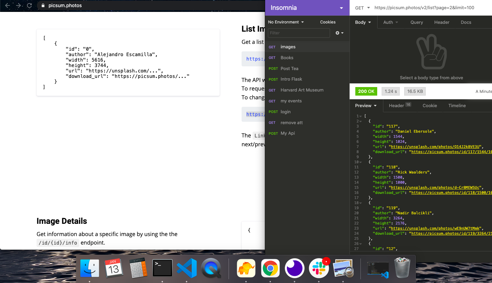
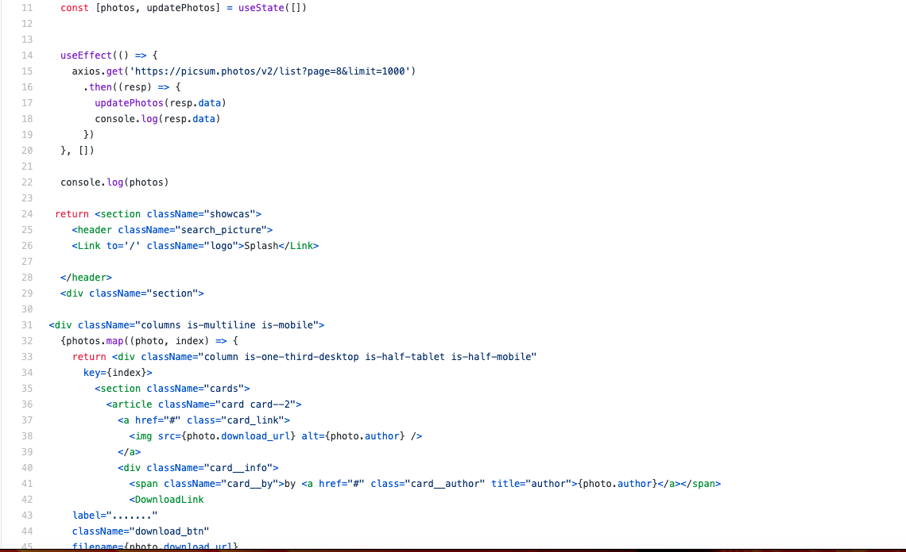
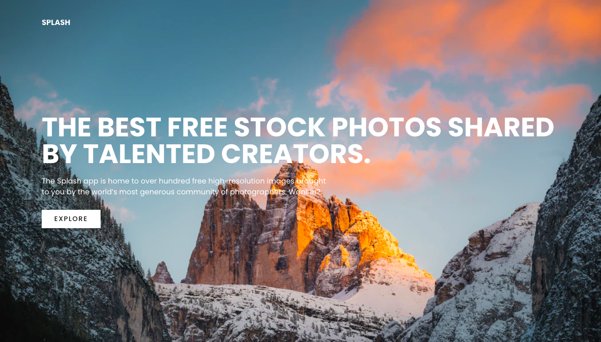
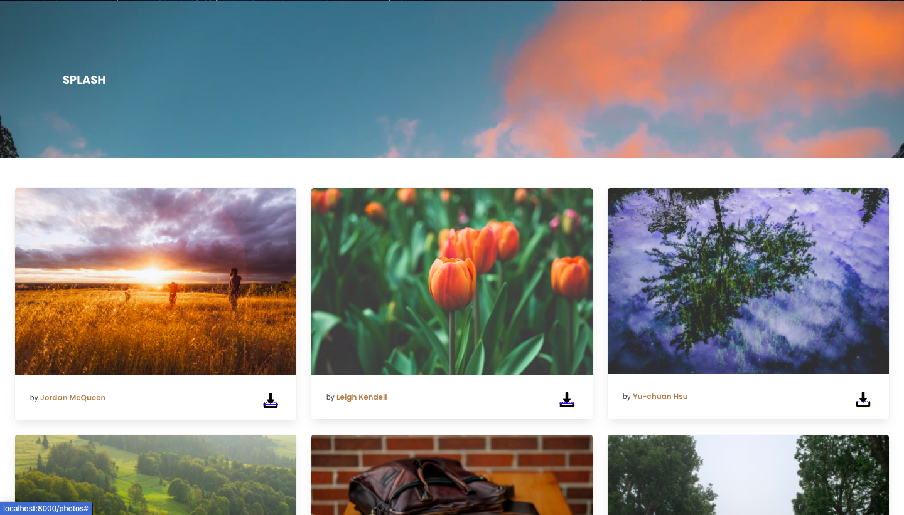

# Splash | 48 hr Hackathon

# Overview. 

This was my second project in the General Assembly Software Engineering Immersive course. It followed a week of learning about React and so it was a real test of how quickly I had picked up the language. This project was completed just under 48 hours. You can launch the app on GitHub pages here.

Link to the website: https://splash2.netlify.app/

# Brief

The app had to:
* Consume a public API.
* Have several components, at least one classical and one functional.
* The app should include a router and at least two pages.
* Include wireframes that were designed before building the app.

# Technologies Used

* HTML
* CSS
* JavaScript (ES6)
* React
* APIs
* Insomnia
* Git and GitHub

# Approach

I looked at the various APIs that were available and decided that with i would use unsplash website APIs that has millions of great photos. My idea for this project was to create a website where anyone that visit the site can view and download the image. You can also view the photographer full name on each images.

The first page is relatively simple - it gives you a glimps of what the website is about. 

# API 
I got my API from a website called "Unsplash". I used that API do view all the information on Insomnia. 

Here is code screenshot of the photo.js page :

# Screenshots

Here is a screeshot of the Homepage:

Here is a screeshot of the Explorepage. You can download any of the images displayed in this page:

# Challenges 
The biggest challenge I had was the timing of the project. It would be great if I had time to finish the search function.

# What I should have added and what have I learnt?

This was a 48 hour Hackathon project challenge. I run out of time - I would have like to add a search bar on top of the second page and add another external API. In the future I will plan out my projects before starting to code and to manage my time better.  
